# Capstone Project E-commerce Platform Deployment
## Creating a directory
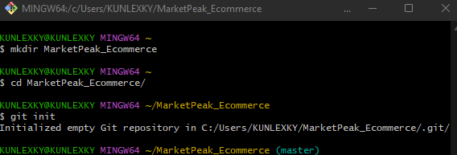
## Staging and commiting
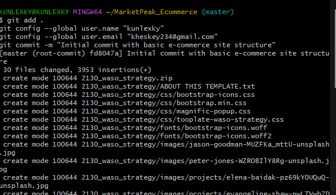
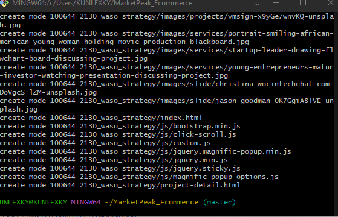
## New Remote Repository
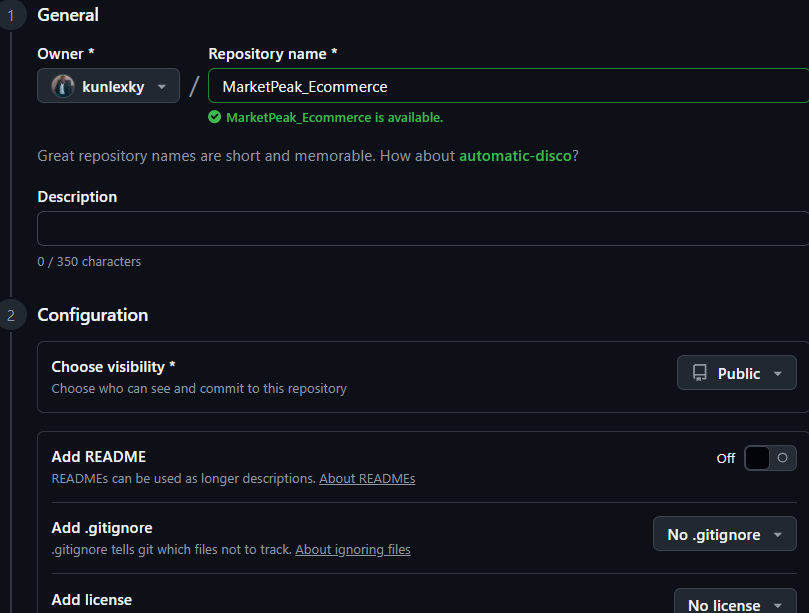
## Linking Repository to Github
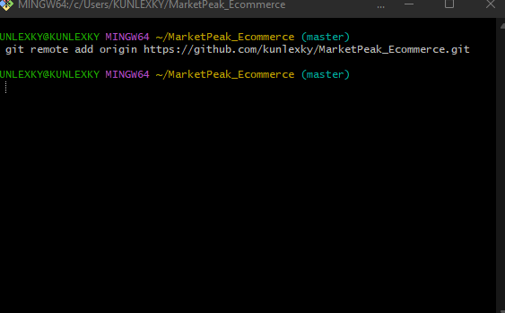
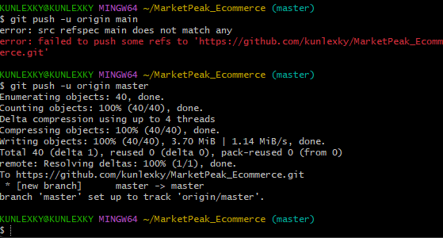
## AWS account
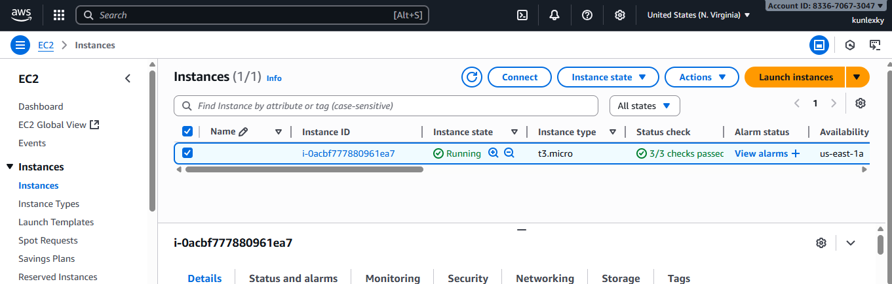
## SSh key gen
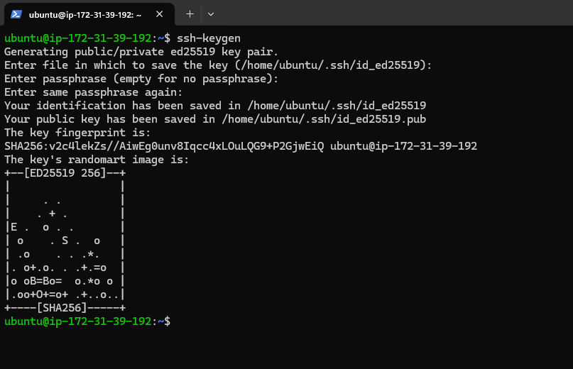
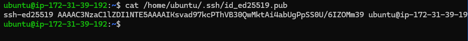
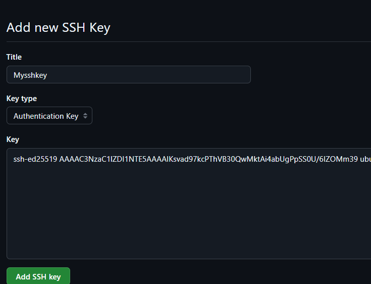
## Cloning the repository
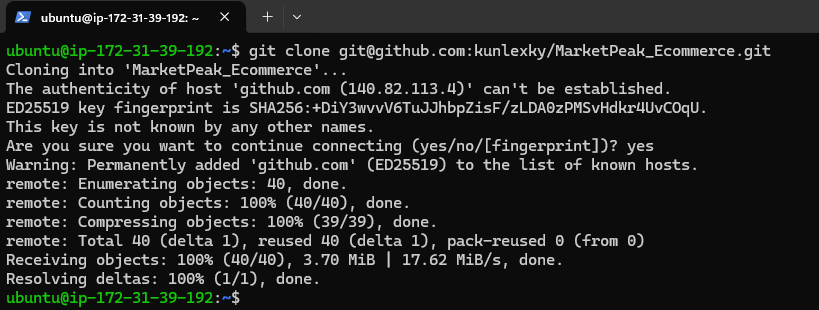
## Installing a web server
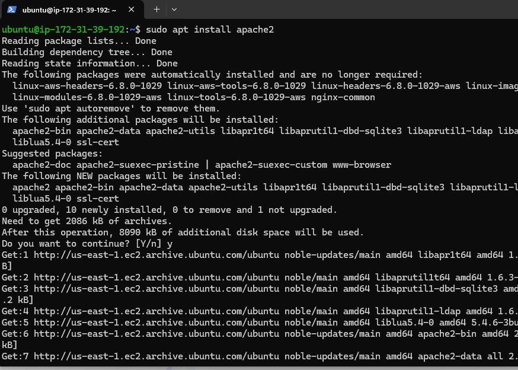
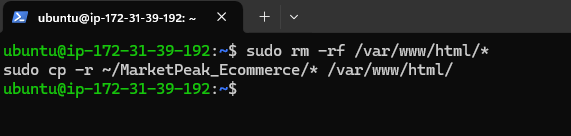
## Accessing the web server

## Creating new branch
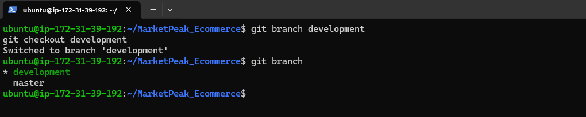
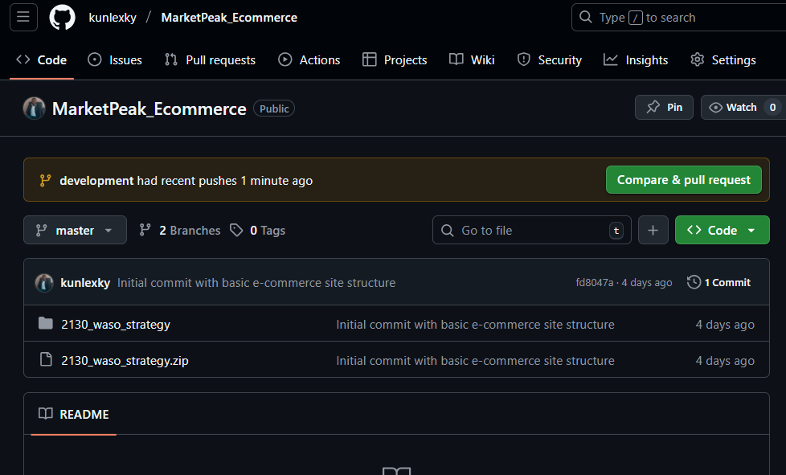
## Pulling a request
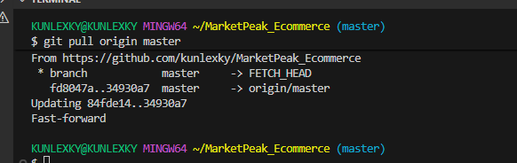
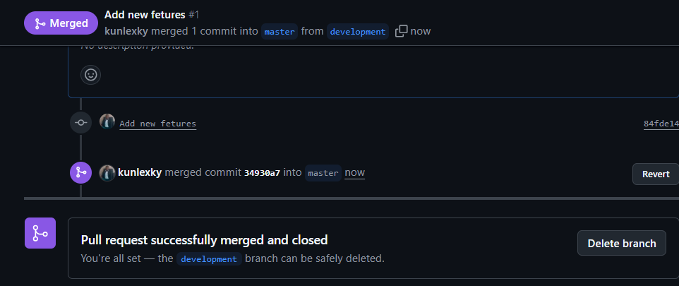